1. set the URL; create tokens
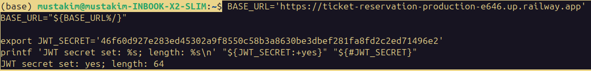

2. Check health and authentication
Both should return 200.
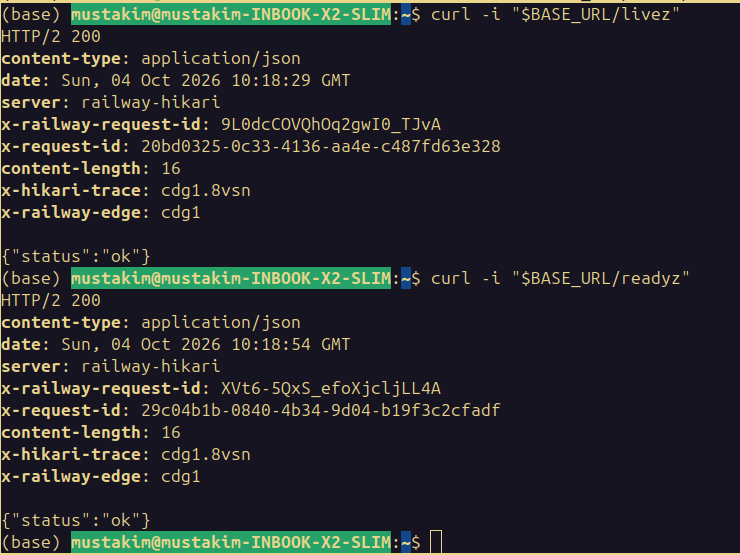

No token should get 401; a user token should get 403 for show creation:
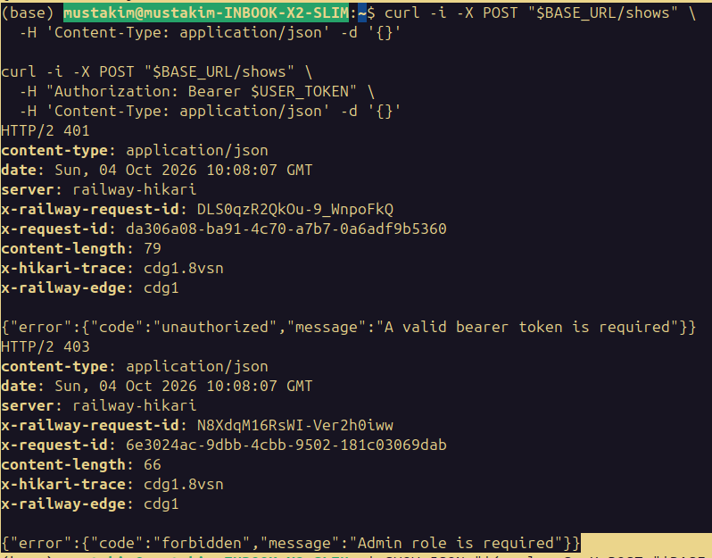

3. Create a show and test GET /shows/{id}
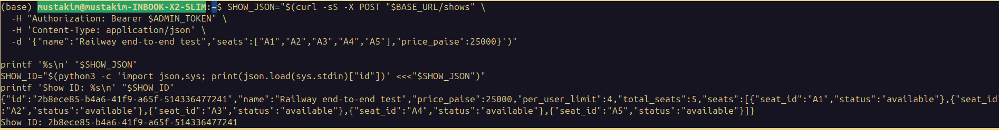

Expect 201 and a nonempty show ID. Test the full and summary responses:
```
(base) mustakim@mustakim-INBOOK-X2-SLIM:~$ curl -sS "$BASE_URL/shows/$SHOW_ID" | python3 -m json.tool
curl -sS "$BASE_URL/shows/$SHOW_ID?summary=true" | python3 -m json.tool
curl -i "$BASE_URL/shows/00000000-0000-4000-8000-000000000000"
{
    "id": "2b8ece85-b4a6-41f9-a65f-514336477241",
    "name": "Railway end-to-end test",
    "price_paise": 25000,
    "per_user_limit": 4,
    "available": 5,
    "held": 0,
    "confirmed": 0,
    "total_seats": 5,
    "seats": [
        {
            "seat_id": "A1",
            "status": "available"
        },
        {
            "seat_id": "A2",
            "status": "available"
        },
        {
            "seat_id": "A3",
            "status": "available"
        },
        {
            "seat_id": "A4",
            "status": "available"
        },
        {
            "seat_id": "A5",
            "status": "available"
        }
    ]
}
{
    "id": "2b8ece85-b4a6-41f9-a65f-514336477241",
    "name": "Railway end-to-end test",
    "price_paise": 25000,
    "per_user_limit": 4,
    "available": 5,
    "held": 0,
    "confirmed": 0,
    "total_seats": 5
}
HTTP/2 404 
content-type: application/json
date: Sun, 04 Oct 2026 10:08:44 GMT
server: railway-hikari
x-railway-request-id: 4mubNIGFSVCAuJr1n6XIxQ
x-request-id: ddb8853f-d2c8-4a2a-bdfb-1ba2ae99dbc1
content-length: 63
x-hikari-trace: cdg1.e9jw
x-railway-edge: cdg1

{"error":{"code":"show_not_found","message":"Show not found"}}
```

4. Reserve, replay, and check conflicts
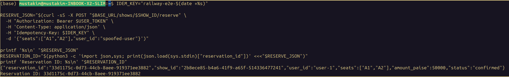

Expect 201, with "user_id":"user-1". Replay the exact request using the same key; expect 201 and Idempotent-Replayed: true:
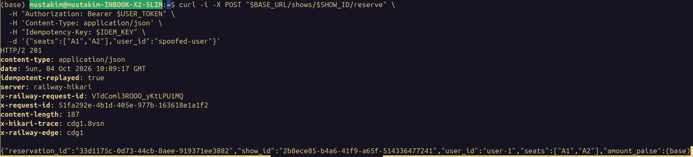

Same key with different seats should return 409 idempotency_key_conflict:
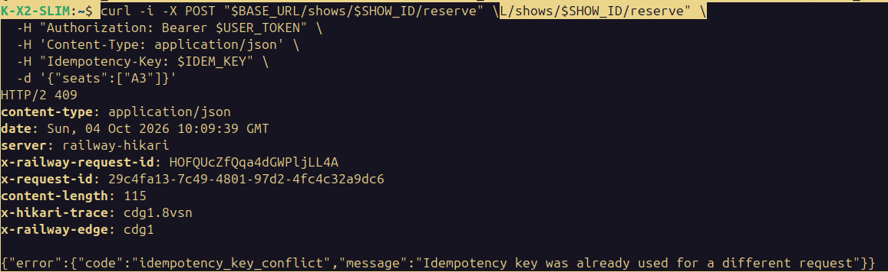

User 2 trying to reserve taken seat A1 should return 409:
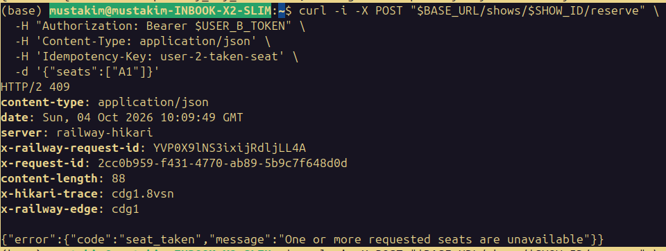

User 1 has two seats. Trying to reserve three more should exceed the default limit of four and return 409:
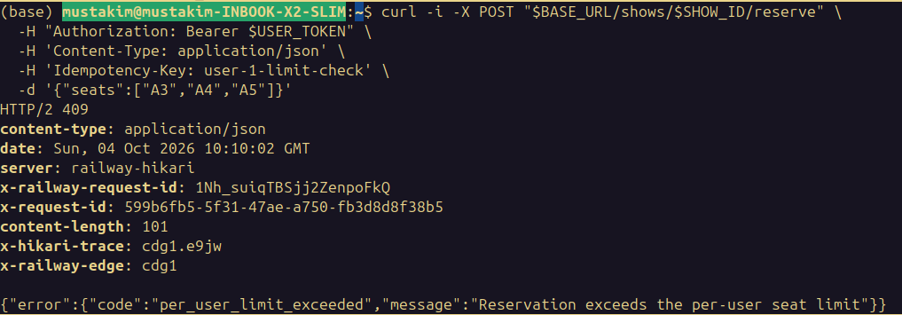

5. Cancel and test that replays don’t restore old seats
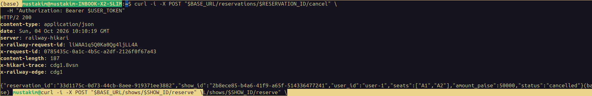

Repeat that command; it should also return 200. Replay the original reserve request with the same idempotency key:
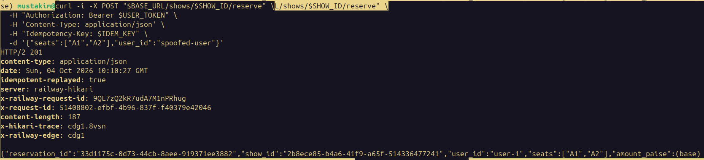

It should return the stored 201 response with Idempotent-Replayed: true; it should not rebook the cancelled seats.
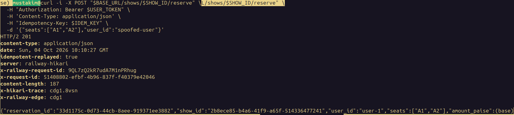

Now user 2 should be able to reserve A1:
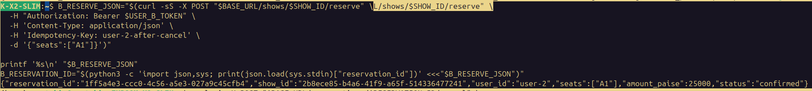

Replay user 1’s old cancellation. Then try cancelling user 2’s reservation as user 1:
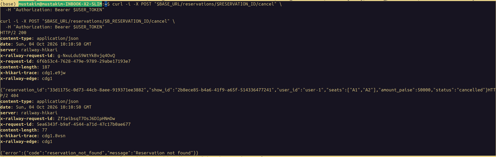

The first should return 200 without freeing user 2’s A1; the second should return 404 because user 1 isn’t the owner. Check the show:
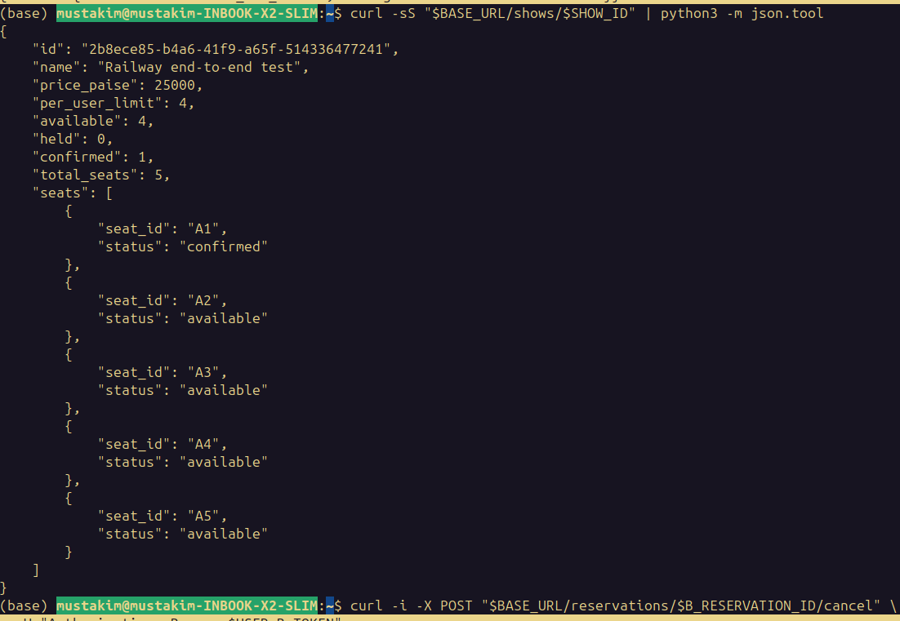

A1 should still be confirmed. Cancel it as user 2 to clean up:
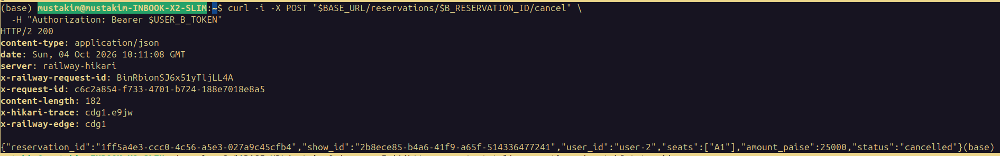

6. Check metrics
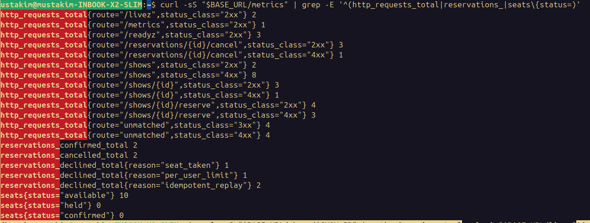